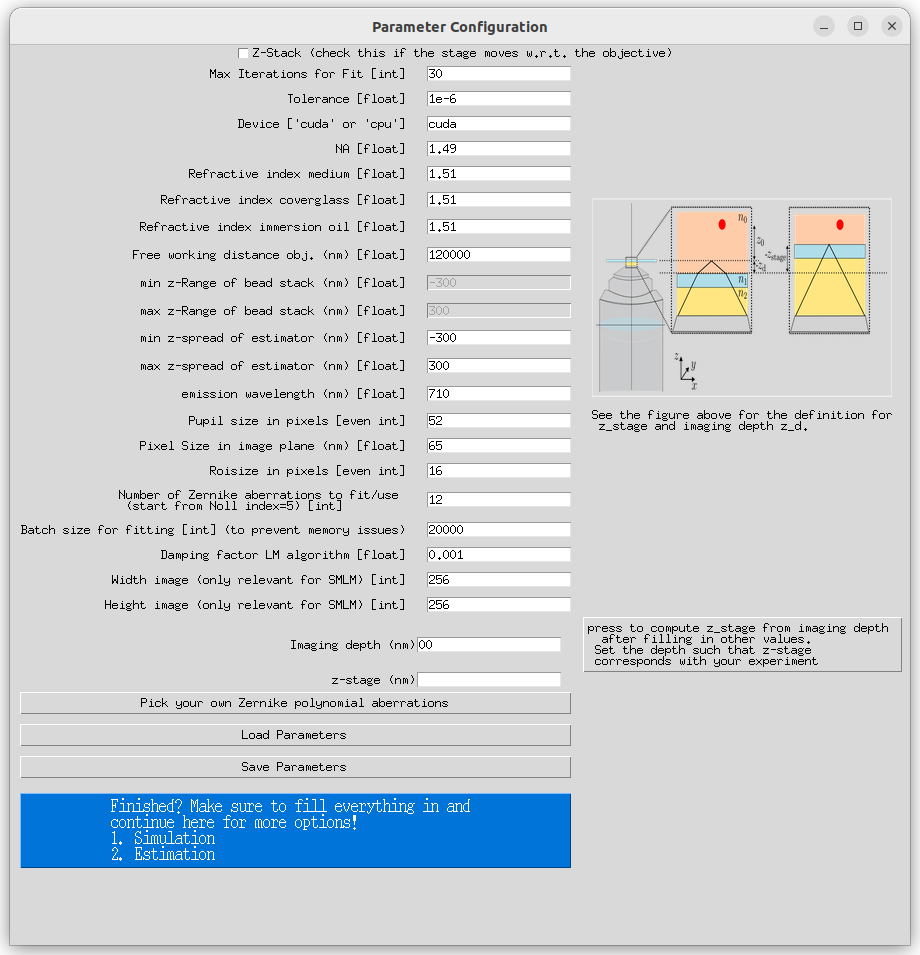
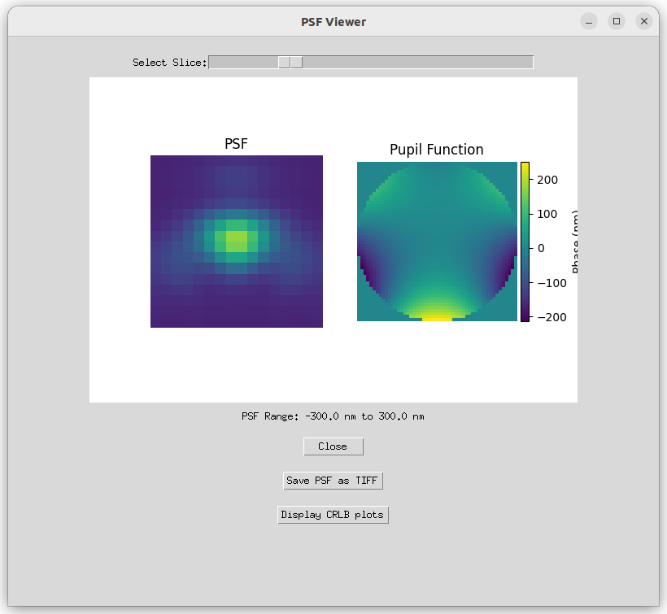
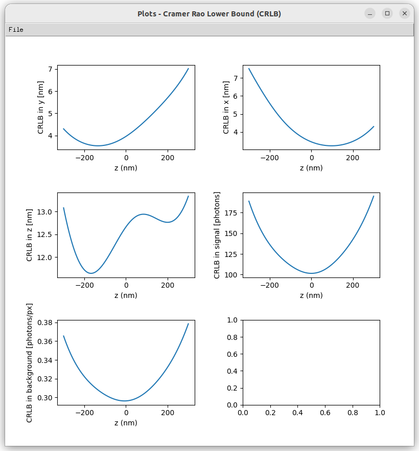
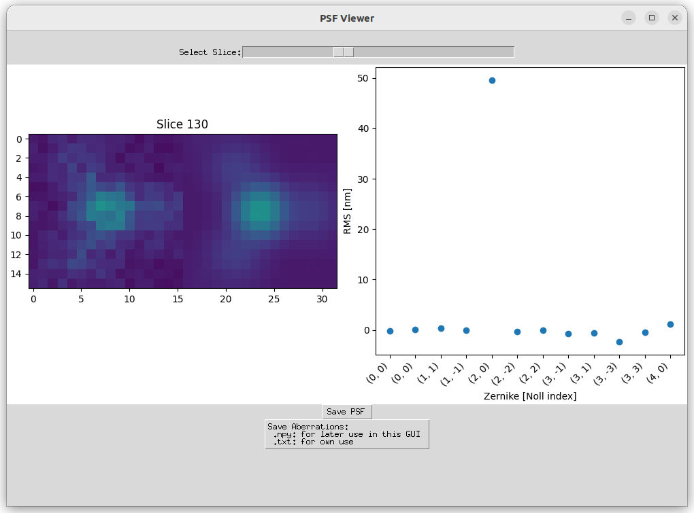
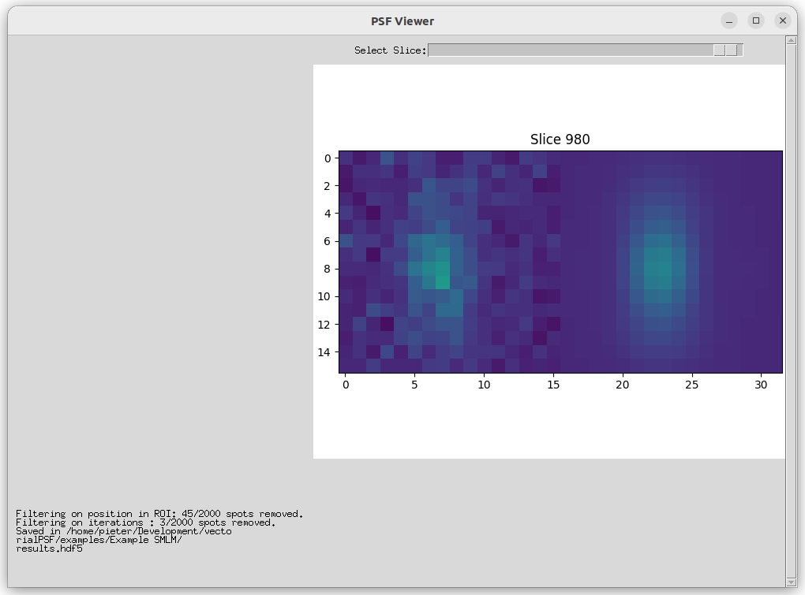

# Vectorial PSF

Vectorial PSF is a tool designed to facilitate the fitting of aberrations in your optical fluorescent microscope system.


## Table of Contents

- [Introduction](#introduction)
- [Features](#features)
- [Getting Started](#getting-started)
  - [Prerequisites](#prerequisites)
  - [Installation](#installation)
  - [Usage](#usage)
- [License](#license)


## Introduction
We utilize a vector PSF model to address axial localization errors arising from model mismatches, providing insights into accurate 3D emitter localization.

## Features

Explore the capabilities of the Vectorial PSF tool and unlock valuable insights into your optical system:

1. **Choose Zernike Aberrations and Investigate PSF Effects**

   Select optical Zernike aberrations and study their impact on the Point Spread Function (PSF) and its influence on the Cramer-Rao Lower Bound (CRLB).

   
   
   

2. **Accurate Aberration Determination Using Through-Focus Scans**

   Utilize a through-focus scan of fluorescent beads to identify aberrations within your system. 

   

3. **Spot Fitting from SMLM Data**

   Load candidate emitters from Single-Molecule Localization Microscopy (SMLM) data and fit spots. Save the results in HDF5 files, ready for further in-depth analysis using Picasso (https://github.com/jungmannlab/picasso). 

   
## Getting Started

### Prerequisites

This system has been tested on Ubuntu 22.04. The main requirements are Python >3.8 and PyTorch (tested on PyTorch 2.0.1 and CUDA 11.8). A CUDA compatible driver is recommended for faster calculations, but a CPU version should work as well.

### Installation

Follow these steps to get started:

1. **Clone the Repository:**
   ```shell
   git clone https://github.com/pvanvelde/VectorialPSF.git
   cd VectorialPSF
 
2. **Create and Activate a New Conda Virtual Environment:**
   ```shell
   conda create --name vectorial_psf_env python=3.10
   conda activate vectorial_psf_env

3. **Install Dependencies:**
   ```shell
   pip install -r requirements.txt

4. **Run the Application:**
   ```shell
   python GUI.py
### Usage

1. **Parameter Configuration:**
   Fill in all the parameters on the main screen. You can save or load these parameters for later use. If applicable, you can also select aberrations (for aberration fitting it is not necessary at this stage).

2. **Choose Actions:**
   Press the blue button to choose from the following actions:
   - 'View PSF': Visualize the Point Spread Function (PSF) and the Cramer-Rao Lower Bound (CRLB) corresponding to the input parameters.
   - 'Load Through-Focus Image of Beads (Z-Stack)': Example data is available in '/examples/Example Aberration Fit':
     - Ensure 'z_stack' is checked on the input screen.
     - Select an initial guess for the aberrations.
     - Load the through-focus scan with a file extension of .tif(f).
     - The shape of the image should be: [number of beads, number of z-slices, ROI size, ROI size].
   - 'Fit Emitters': Example data is available in '/examples/Example SMLM':
     - Ensure the correct aberrations are loaded.
     - Open candidate emitters saved in .tif(f): [number of spots, ROI size, ROI size].
     - Open a .txt file containing the positions of the ROIs in the image, formatted as: [frame, row (upper left), column (upper left)], with a number of rows equal to the number of spots.
     - Choose a .hdf5 file to save the results.

## License

This project is licensed under the MIT License. You can find a copy of the license in the [LICENSE](LICENSE) file.

